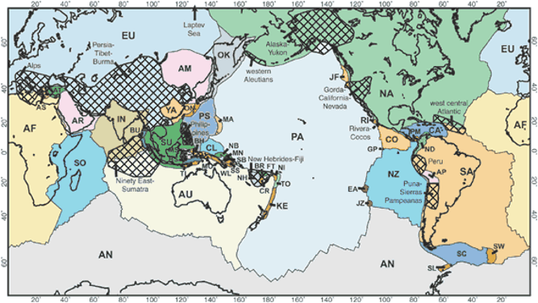

# plate_motion

## はじめに

plate_motion は ITRF2005 で求めたプレートの絶対回転運動を出力するプログラムである。  
<https://doi.org/10.1029/2007JB004949>

Table 8. ITRF2005 Absolute Rotation Poles(筆者編集)  
※ Nubia Plate -> African Plate,  Amurian microplate -> Amur microplate  
※ N. America Plate-> North America Plate, S. America Plate -> South America Plate  
※ Okhostk -> Okhotsk  
※ plateの一部は求まってない

| Plate         |  ϕ, deg |   λ, deg | ω, deg/m.y. | σϕ, deg | σλ, deg | σω, deg/m.y. |
| :------------ | ------: | -------: | ----------: | ------: | ------: | :----------- |
| Amur          |  56.263 | -102.789 |       0.269 |   6.532 |   8.569 | 0.011        |
| Antarctica    |  59.813 | -125.315 |       0.223 |   0.864 |   1.676 | 0.007        |
| Arabia        |  49.642 |    5.061 |       0.579 |   0.581 |   2.278 | 0.019        |
| Australia     |  32.407 |   37.367 |       0.628 |   0.267 |   0.356 | 0.003        |
| Caribbean     |  39.318 | -104.279 |       0.241 |  10.553 |  35.968 | 0.145        |
| Eurasia       |   56.33 |  -95.979 |       0.261 |   0.549 |   0.969 | 0.003        |
| India         |  49.823 |   21.841 |       0.614 |   6.628 |  24.578 | 0.108        |
| Nazca         |  45.101 | -101.441 |       0.642 |   1.856 |   0.753 | 0.015        |
| North America |  -4.291 |  -87.385 |       0.192 |   0.861 |   0.571 | 0.002        |
| African       |  49.955 |  -82.501 |       0.269 |   0.483 |   1.255 | 0.003        |
| Okhotsk       | -32.041 |  -132.91 |       0.083 |   7.519 |  12.034 | 0.006        |
| Pacific       | -62.569 |  112.873 |       0.682 |   0.222 |   0.743 | 0.004        |
| South America |   -16.8 | -129.631 |       0.121 |   1.593 |   2.051 | 0.003        |
| Somalia       |  53.661 |  -89.542 |       0.309 |    3.65 |   8.988 | 0.019        |
| Yangtze       |  59.425 | -109.737 |        0.31 |   6.651 |  18.298 | 0.021        |

plate boundariesは[An updated digital model of plate boundaries](https://doi.org/10.1029/2001GC000252)の基づく



## Install

```bash
python -m pip install ~/plate_motion
python -m pip install git+https://github.com/Torahugu1/plate_motion.git
```

## Usage

```python
from plate_motion import belong_plate_name, plate_motion, plate_motion_enu

# KHABAROVSK
lat = 48.330
lon = 135.046
# ここでどのプレートに属するかを決める
plate_name = belong_plate_name(lat, lon)
e, n, u = plate_motion(plate_name, lat, lon, 0)
# プレート名ではなく実際の回転極の数値で入力
e, n, u = plate_motion_enu(lat, lon, 0, 56.263, -102.789, 0.269)
```

## test 方法

```bash
cd ~/plate_motion
poetry run pytest -s -v
```
